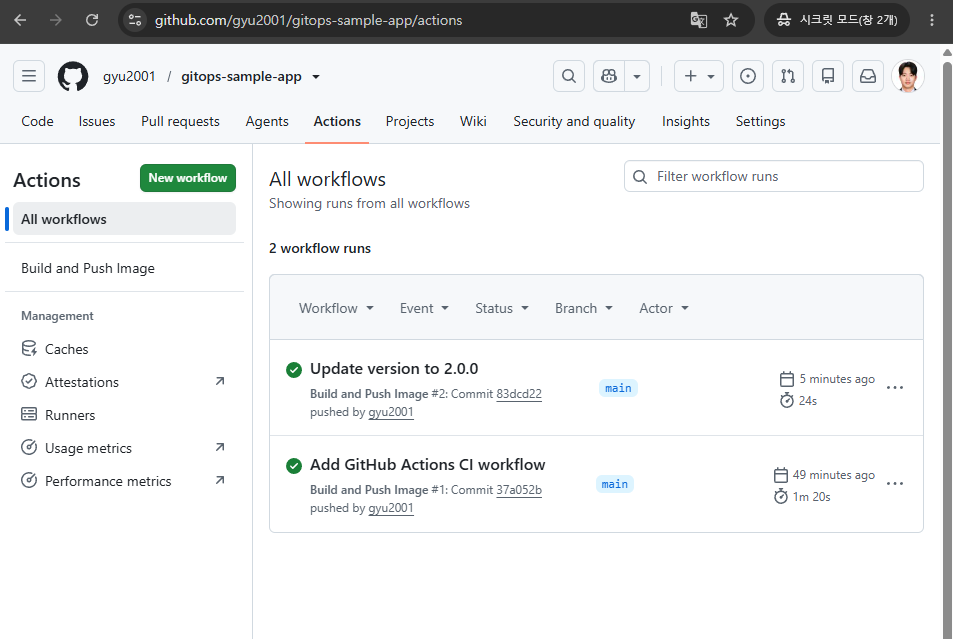
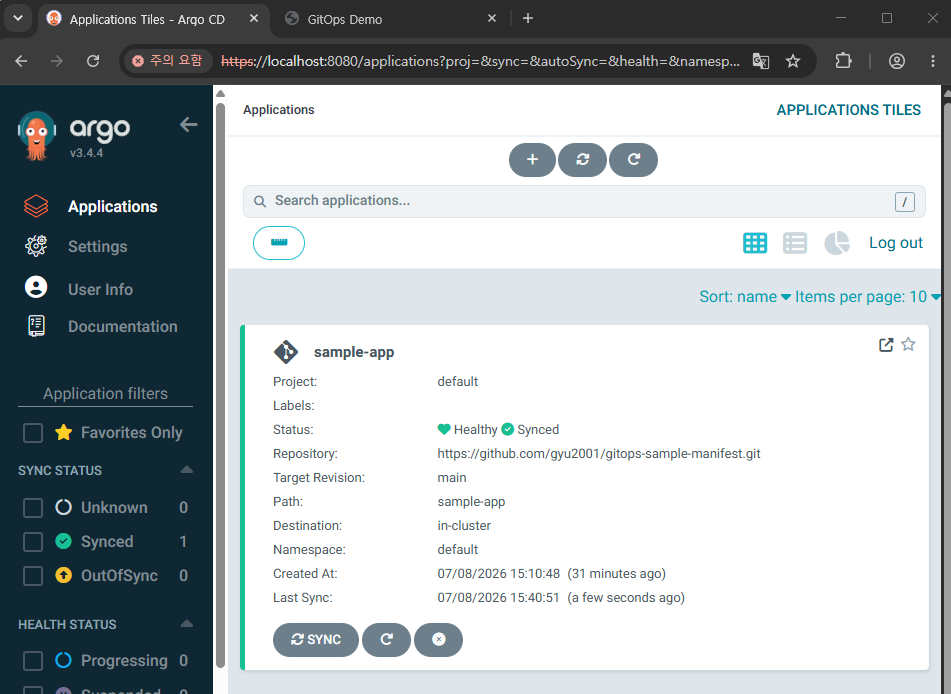
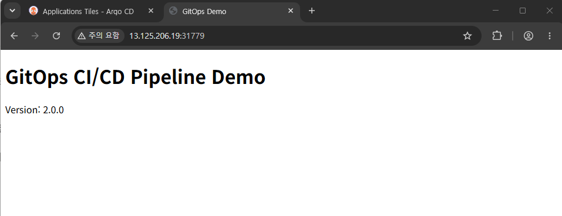

# gitops-sample-manifest

GitOps CI/CD 파이프라인 실습 프로젝트의 **배포 매니페스트 레포**입니다.
Helm 차트로 애플리케이션 배포를 정의하고, ArgoCD가 이 레포를 감시하며
kubeadm 클러스터에 자동 배포(GitOps)합니다.

애플리케이션 소스는 [gitops-sample-app](https://github.com/gyu2001/gitops-sample-app) 참고.

---

## 전체 아키텍처

```
[gitops-sample-app] --(GitHub Actions)--> GHCR 이미지 push
                                               |
[이 레포] Helm values의 이미지 태그 업데이트 ---+
       |
       | (ArgoCD가 이 레포를 감시)
       v
  ArgoCD --- 자동 동기화(auto-sync) ---> kubeadm 클러스터(EC2)
```

## GitOps 흐름

1. 앱 레포에서 이미지가 빌드되어 GHCR에 새 태그로 올라감
2. 이 레포의 `sample-app/values.yaml`에서 이미지 태그를 갱신
3. ArgoCD가 이 레포의 변경을 감지
4. auto-sync 정책에 따라 클러스터에 새 버전을 자동 배포
5. 실제 서비스에 반영 (버전 변경 확인)

## 인프라 환경

| 항목 | 값 |
|---|---|
| 클러스터 | kubeadm 기반 멀티 노드 (Control-plane 1, Worker 1) |
| 실행 환경 | AWS EC2 (m7i-flex.large) |
| CNI | Calico |
| 배포 도구 | ArgoCD (auto-sync, self-heal) |
| 패키징 | Helm |

## 사용 기술

`Kubernetes` `ArgoCD` `Helm` `kubeadm` `Calico` `AWS EC2`

---

## 트러블슈팅 — ArgoCD 배포 실패 (DNS 조회 타임아웃)

ArgoCD가 애플리케이션을 배포하려 할 때 아래 오류가 반복 발생했습니다.

```
ComparisonError: Failed to load target state: ... rpc error: code = Unavailable
desc = dns: A record lookup error: lookup argocd-repo-server on 10.96.0.10:53:
dial udp 10.96.0.10:53: i/o timeout
```

**원인 추적 과정**
1. ArgoCD 파드, CoreDNS, Calico 모두 `Running` 상태로 인프라 자체는 정상
2. 클러스터 내부에서 DNS 조회를 직접 테스트 → 서비스 이름 변환 실패(`can't resolve`)
3. 오류 메시지의 `dial udp ... i/o timeout`에 주목 → **UDP 통신**이 막힌 정황
4. EC2 보안그룹 인바운드 규칙 확인 → 노드 간 통신 규칙이 **"모든 TCP"로만** 열려 있었음

**원인**
Calico는 다른 노드로 가는 파드 트래픽을 **IP-in-IP(IP 프로토콜 4번)**로 감싸서 보냅니다.
보안그룹은 이 바깥쪽 헤더만 보기 때문에, 노드 간 규칙이 "모든 TCP"로만 열려 있으면
캡슐화된 트래픽 전체가 차단됩니다. 그 결과 다른 노드에 있는 CoreDNS로 가는
DNS 질의(UDP 53)가 타임아웃되었고, 에러 메시지에는 UDP 타임아웃으로 나타났습니다.

**조치**
원인 확인을 위해 보안그룹의 노드 간 통신 규칙을 "모든 TCP" → **"모든 트래픽(All traffic)"**으로
변경했고, 배포가 정상화되는 것을 확인했습니다.

다만 이는 원인을 확정하기 위한 임시 조치입니다. 최소 권한 원칙에 맞추려면
노드 간에는 아래만 열고, 소스를 같은 보안그룹(자기 참조)으로 제한해야 합니다.

| 용도 | 프로토콜 / 포트 |
|---|---|
| Calico IP-in-IP | IP 프로토콜 4 |
| Calico BGP | TCP 179 |
| Kubernetes API | TCP 6443 |
| kubelet | TCP 10250 |

**결과**
DNS 조회가 정상 동작(`argocd-repo-server` → ClusterIP 정상 변환)하고,
ArgoCD의 ComparisonError가 해소되어 애플리케이션이 정상 배포(Synced/Healthy)되었습니다.

> 배운 점: 파드/서비스가 모두 Running이어도, 노드 간 네트워크 계층(L3/L4)이
> 막히면 클러스터 DNS가 실패할 수 있다. "Running = 정상"이 아니라 실제 통신을
> 검증해야 한다는 것을 확인했다.

## 실행 결과

### 1. GitHub Actions CI 파이프라인


### 2. ArgoCD 자동 배포 (Synced / Healthy)


### 3. 배포된 애플리케이션 (v2.0.0)

